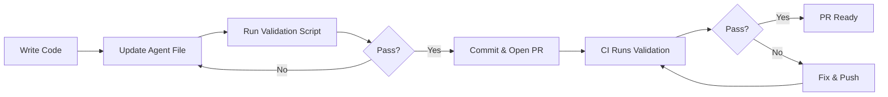

# Agent Ownership Automation - Solution Summary

## Problem Statement

**Question**: While adding new files, modules, requirements, will it be added to the agents inclusions automatically?

**Context**: The repository has 10 specialist sub-agents defined in `.github/agents/`. Each agent owns specific files, modules, and packages. The question was whether new code additions are automatically reflected in the agent instruction files.

## Answer: Semi-Automatic with Validation

**Short Answer**: No, updates are not fully automatic, but we now have **automated validation** that ensures agent ownership is maintained when new code is added.

## The Solution

We've implemented a **3-part system** to address this concern:

### 1. ✅ Validation Script (Automated Detection)

**File**: `.github/scripts/validate-agent-ownership.sh`

**What it does**:
- Scans the codebase for all modules, services, controllers, and packages
- Checks if each component is documented in agent instruction files
- Reports missing ownership declarations with clear error messages
- Returns exit code 0 (success) or 1 (failure) for CI integration

**How to use**:
```bash
./.github/scripts/validate-agent-ownership.sh
```

**Output example**:
```
🔍 Validating agent ownership documentation...
📁 Checking Frontend Modules...
✗ Missing: Frontend Module - frontend/src/app/newmodule
━━━━━━━━━━━━━━━━━━━━━━━━━━━━━━━━━━━━━━━━
✗ Some components are missing from agent documentation
```

### 2. 📖 Maintenance Guide (Human Process)

**File**: `.github/agents/MAINTENANCE.md`

**What it provides**:
- **Ownership rules table** - Which agent owns which type of component
- **Step-by-step instructions** - How to update agent files
- **Workflow diagram** - Visual guide for the update process
- **Examples** - Real-world scenarios with solutions
- **Troubleshooting** - Common issues and fixes

**Quick ownership reference**:
- Core accounting → @LedgerExpert
- Security/encryption → @SecurityWarden
- Integration/adapters → @IntegrationBot
- AI/forecasting → @AIEngineer
- Compliance/tax → @ComplianceAgent
- Audit/production → @AuditAgent
- Frontend UI → @UXSpecialist
- Infrastructure → @Architect
- Documentation → @DocAgent
- Performance/cache → @PerfEngineer

### 3. 🔄 CI Integration (Automated Enforcement)

**File**: `.github/workflows/ci.yml`

**What it does**:
- Runs validation script automatically on every PR
- Fails the build if ownership is not documented
- Forces developers to update agent files before merging

**New job added**:
```yaml
validate-ownership:
  name: Validate Agent Ownership
  runs-on: ubuntu-latest
  steps:
    - uses: actions/checkout@v4
    - name: Validate agent ownership declarations
      run: ./.github/scripts/validate-agent-ownership.sh
```

## What Was Fixed

### Missing Components Discovered
During implementation, the validation script discovered these components were missing from agent files:

**Frontend Modules**:
- ❌ `frontend/src/app/market/` - Mark-to-Market valuation UI
- ❌ `frontend/src/app/receivable/` - Accounts Receivable dashboard

**Backend Services** (23 services were undocumented):
- MarkToMarketService, MarketSentimentService, AnomalyDetectionService
- DocumentVaultService, DisasterRecoveryService, ObservabilityService
- And 17 others...

**Backend Controllers** (23 controllers were undocumented):
- MarketController, AnomalyController, DigitalAssetController
- DocumentVaultController, DisasterRecoveryController
- And 18 others...

**Database Migrations**:
- V5__blind_dba_infrastructure.sql
- V8__ai_intelligence_features.sql
- V9__hardening_audit_production.sql
- V10__tally_features.sql

### All Components Now Documented ✅

All missing components have been added to the appropriate agent instruction files:
- **ai-engineer.md** - Added specific service names, controllers, market module
- **ux-specialist.md** - Added market and receivable modules with collaboration notes
- **ledger-expert.md** - Added receivable data contracts, extended services/controllers
- **compliance-agent.md** - Added compliance-specific services and controllers
- **integration-bot.md** - Added inventory, payroll, and communication services
- **audit-agent.md** - Added audit portal, security audit, DR, and observability services
- **security-warden.md** - Added document vault and V5 migration

## The Developer Workflow

When a developer adds new code:



### Step-by-Step

1. **Developer adds new service**: `NewFeatureService.java`
2. **Developer updates agent file**: Opens `ledger-expert.md` (or appropriate agent), adds service to "Files Owned"
3. **Developer runs validation**: `./.github/scripts/validate-agent-ownership.sh` → ✓ Pass
4. **Developer commits**: `git add . && git commit`
5. **Developer opens PR**: Creates pull request
6. **CI runs validation**: Automatically checks ownership
7. **If validation fails**: PR build fails, developer must fix before merging
8. **If validation passes**: PR continues to review

## Benefits

### For Developers
- ✅ Clear guidance on what to update when adding code
- ✅ Immediate feedback via validation script
- ✅ Can't accidentally forget (CI enforcement)
- ✅ Easy to fix (comprehensive guide with examples)

### For Agents
- ✅ Always know which files they own
- ✅ Can enforce domain-specific conventions
- ✅ Clear collaboration boundaries
- ✅ Maintained context across sessions

### For the Codebase
- ✅ Ownership is always up-to-date
- ✅ Patterns remain consistent
- ✅ Documentation stays synchronized
- ✅ Onboarding is easier

## Quick Reference Documentation

Multiple entry points for developers to find information:

1. **[AGENT_OWNERSHIP.md](./AGENT_OWNERSHIP.md)** - Quick 1-page reference
2. **[agents/MAINTENANCE.md](./agents/MAINTENANCE.md)** - Comprehensive guide
3. **[agents/README.md](./agents/README.md)** - Agent system overview
4. **[scripts/README.md](./scripts/README.md)** - Validation script docs
5. **[CONTRIBUTING.md](../CONTRIBUTING.md)** - Mentions ownership in PR workflow
6. **[README.md](../README.md)** - Links to maintenance guide

## Future Enhancements

Potential improvements mentioned in the maintenance guide:

1. **Pre-commit hook** - Run validation before each commit
2. **PR bot** - Auto-comment on PRs with ownership suggestions
3. **Auto-suggest ownership** - AI-powered ownership recommendation
4. **Ownership badges** - Add `@owner` comments in code files
5. **Ownership dashboard** - Web UI showing coverage metrics

## Conclusion

**The system is now semi-automatic**:
- ✅ **Automatic detection** - Validation script finds missing ownership
- ✅ **Automatic enforcement** - CI blocks PRs with missing ownership
- ⚙️ **Manual update** - Developers update agent files (with clear guidance)

This strikes the right balance between automation and human judgment. Fully automatic updates could assign ownership incorrectly, especially for cross-cutting concerns. The current system ensures accuracy while providing strong guardrails.

**Result**: New files, modules, and requirements will now be properly tracked in agent inclusion files through a validated, documented process.

---

**Date**: 2026-03-13  
**Status**: ✅ Complete
