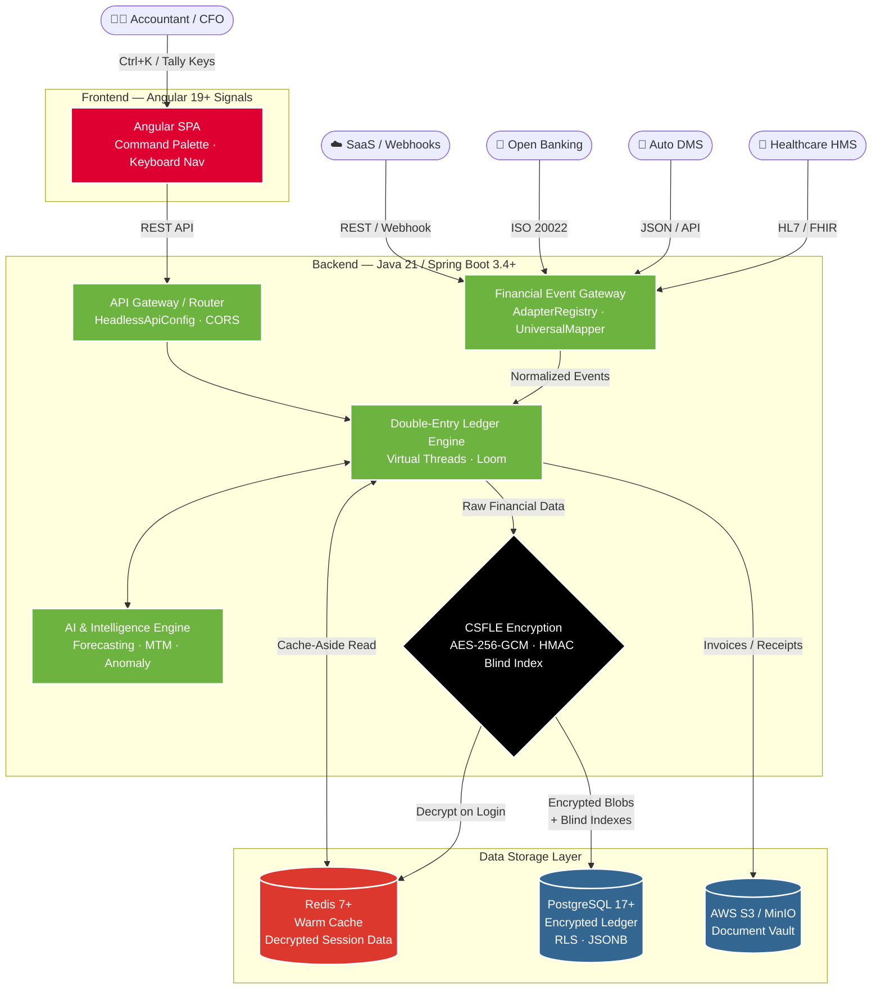
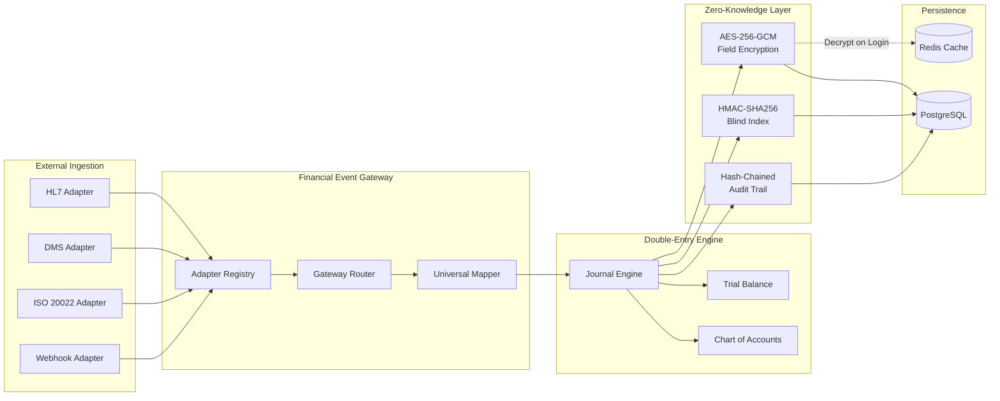
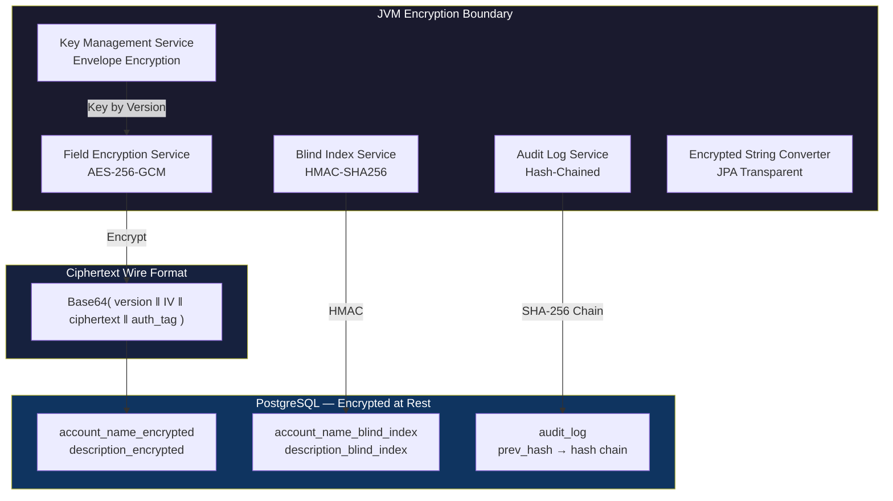
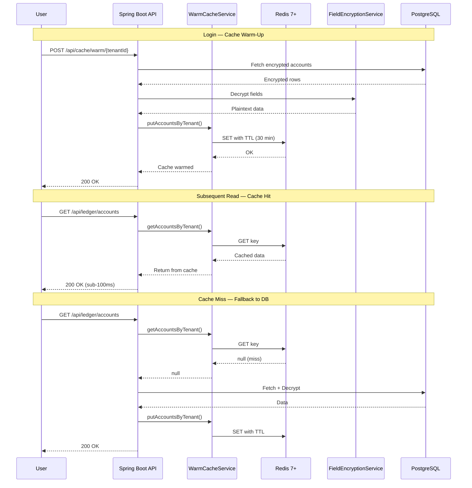
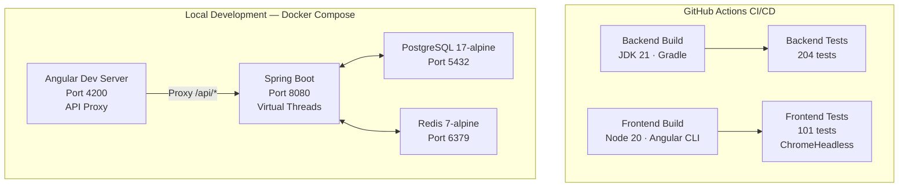
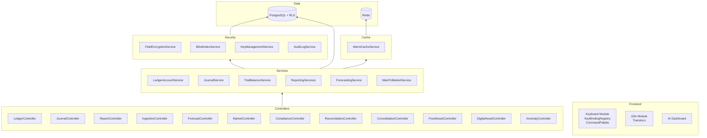

# OneBook — Architecture Diagram

> Comprehensive system architecture for the Nexus Universal Accounting OS.

---

## High-Level System Architecture

---

## Data Flow Architecture

---

## Security Architecture

---

## Cache Strategy

---

## Deployment Architecture

---

## Module Dependency Graph

---

## Related Documentation

- [Key-Binding Registry Design](key-binding-registry.md)
- [SQL Schema Documentation](sql-schema.md)
- [API Documentation](api-documentation.md)
- [Developer Onboarding Guide](developer-guide.md)
- [Operational Runbook](operational-runbook.md)
