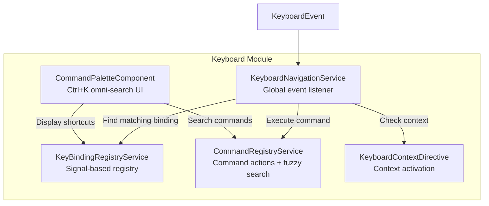
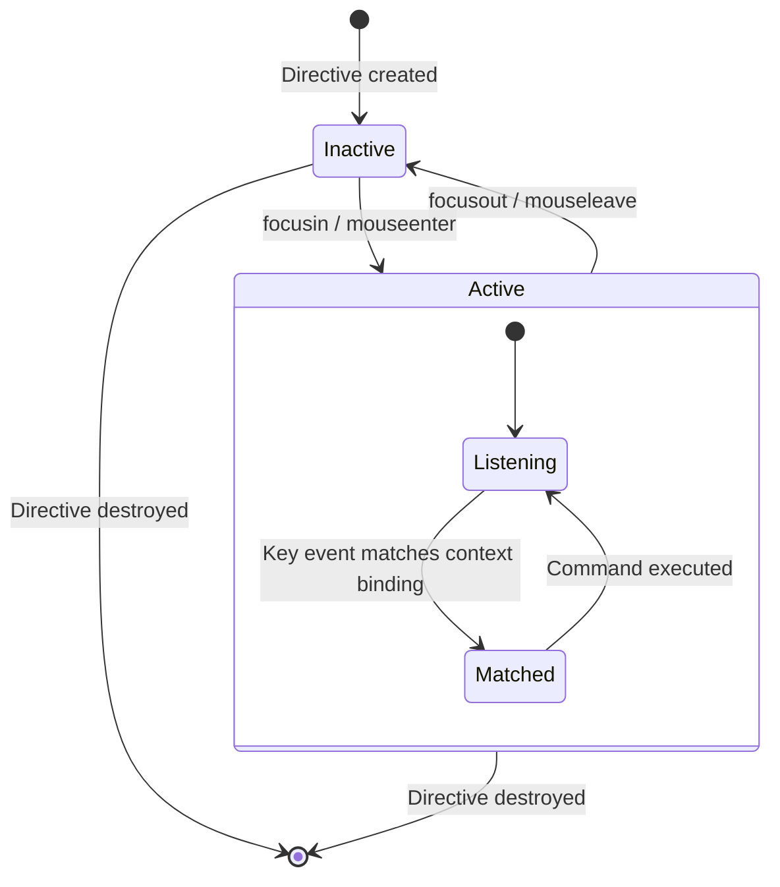

# OneBook — Key-Binding Registry Technical Design

> Technical design document for the keyboard navigation system: legacy Tally shortcuts, modern Command Palette, conflict resolution, and extensibility.

---

## Table of Contents

1. [Overview](#overview)
2. [Architecture](#architecture)
3. [Data Models](#data-models)
4. [Legacy Tally Key Mappings](#legacy-tally-key-mappings)
5. [Command Palette](#command-palette)
6. [Conflict Resolution](#conflict-resolution)
7. [Extensibility](#extensibility)
8. [Contextual Bindings](#contextual-bindings)
9. [Accessibility](#accessibility)

---

## Overview

OneBook implements a "Better-than-Tally" keyboard-first UX that preserves all legacy Tally shortcuts while adding a modern Command Palette (Ctrl+K / Cmd+K). The system is built on Angular 19+ Signals for reactive state management, providing instant UI updates when bindings change.

### Design Goals

| Goal | Implementation |
|------|----------------|
| **Tally Compatibility** | All legacy F-key and Alt+key shortcuts pre-loaded as defaults |
| **Modern UX** | Command Palette with fuzzy search (Ctrl+K / Cmd+K) |
| **Zero-Mouse Workflows** | Every accounting operation accessible via keyboard |
| **Contextual Shortcuts** | Keys adapt to the active screen (reports, voucher entry, etc.) |
| **User Customization** | Users can rebind any shortcut without code changes |
| **Accessibility** | Full ARIA compliance, screen-reader support |

---

## Architecture



### Service Responsibilities

| Service | Responsibility |
|---------|---------------|
| **KeyBindingRegistryService** | Stores and manages all keyboard shortcut definitions. Provides parsing, matching, and rebinding APIs. Pre-loads Tally defaults. |
| **CommandRegistryService** | Maps command IDs to executable actions. Provides fuzzy search across labels, categories, descriptions, and keywords. |
| **KeyboardNavigationService** | Listens for keyboard events at the document level. Routes events through contextual → global binding resolution. Manages active context state. |
| **CommandPaletteComponent** | UI overlay triggered by Ctrl+K / Cmd+K. Renders searchable command list with keyboard navigation (↑↓ Enter Esc). |
| **KeyboardContextDirective** | Structural directive that activates/deactivates keyboard contexts based on focus and hover. |

---

## Data Models

### KeyBinding

```typescript
interface KeyBinding {
  id: string;           // Unique identifier (e.g., 'voucher.contra')
  label: string;        // Display name (e.g., 'Contra Voucher')
  keys: string;         // Key combination (e.g., 'F4', 'Alt+C', 'Ctrl+K')
  category?: string;    // Grouping (e.g., 'Vouchers', 'Reports')
  description?: string; // Help text for tooltips and accessibility
  enabled: boolean;     // Whether the binding is active
}
```

### Command

```typescript
interface Command {
  id: string;           // Matches KeyBinding.id for auto-linking
  label: string;        // Display name in Command Palette
  category?: string;    // Category badge in palette
  description?: string; // Secondary text in palette
  action: () => void;   // Execution handler
  icon?: string;        // Optional icon identifier
  keywords?: string[];  // Additional search terms for fuzzy matching
}
```

### ContextualKeyMap

```typescript
interface ContextualKeyMap {
  contextId: string;     // Context identifier (e.g., 'reports', 'voucher-entry')
  contextLabel: string;  // Human-readable context name
  bindings: KeyBinding[]; // Bindings active only in this context
}
```

### ParsedKeyCombo

```typescript
interface ParsedKeyCombo {
  key: string;    // The primary key (e.g., 'K', 'F4', 'Escape')
  ctrl: boolean;  // Ctrl modifier required
  alt: boolean;   // Alt modifier required
  shift: boolean; // Shift modifier required
  meta: boolean;  // Meta (Cmd on macOS) modifier required
}
```

---

## Legacy Tally Key Mappings

The `KeyBindingRegistryService` pre-loads 17 Tally-compatible shortcuts on initialization via `loadDefaults()`.

### Voucher Shortcuts

| Key | ID | Action | Tally Equivalent |
|-----|----|--------|------------------|
| `F4` | `voucher.contra` | Open Contra Voucher | F4 Contra |
| `F5` | `voucher.payment` | Open Payment Voucher | F5 Payment |
| `F6` | `voucher.receipt` | Open Receipt Voucher | F6 Receipt |
| `F7` | `voucher.journal` | Open Journal Voucher | F7 Journal |
| `F8` | `voucher.sales` | Open Sales Voucher | F8 Sales |
| `F9` | `voucher.purchase` | Open Purchase Voucher | F9 Purchase |

### Master Shortcuts

| Key | ID | Action | Tally Equivalent |
|-----|----|--------|------------------|
| `Alt+C` | `master.create` | Create Master | Alt+C Create |
| `Alt+A` | `master.alter` | Alter Master | Alt+A Alter |
| `Alt+D` | `master.display` | Display Master | Alt+D Display |

### Action Shortcuts

| Key | ID | Action | Tally Equivalent |
|-----|----|--------|------------------|
| `Ctrl+A` | `action.save` | Save Current Form | Ctrl+A Accept/Save |
| `Alt+D` | `action.delete` | Delete Entry | Alt+D Delete |
| `Alt+P` | `action.print` | Print Document | Alt+P Print |
| `Alt+E` | `action.export` | Export Data | Alt+E Export |
| `Escape` | `action.close` | Close / Go Back | Esc Close |

### Navigation Shortcuts

| Key | ID | Action |
|-----|-----|--------|
| `Ctrl+K` | `navigation.commandPalette` | Open Command Palette |

### Report Shortcuts

| Key | ID | Action | Tally Equivalent |
|-----|----|--------|------------------|
| `Alt+F2` | `report.dayBook` | Day Book | Alt+F2 |
| `Alt+F3` | `report.trialBalance` | Trial Balance | Alt+F3 |
| `Alt+F5` | `report.profitAndLoss` | Profit & Loss | Alt+F5 |
| `Alt+F7` | `report.balanceSheet` | Balance Sheet | Alt+F7 |

---

## Command Palette

### Activation

The Command Palette is a global omni-search overlay triggered by:
- **Windows/Linux**: `Ctrl+K`
- **macOS**: `Cmd+K` (Meta+K)

### Search Algorithm

The `CommandRegistryService.search(query)` method performs case-insensitive fuzzy matching across four fields:

```
score = match(query, command.label)
      + match(query, command.category)
      + match(query, command.description)
      + match(query, command.keywords[])
```

Any command where the query appears as a substring of any of these fields is returned.

### Keyboard Navigation Within Palette

| Key | Action |
|-----|--------|
| `↑` (ArrowUp) | Move selection up |
| `↓` (ArrowDown) | Move selection down |
| `Enter` | Execute selected command |
| `Escape` | Close palette |

### Shortcut Display

The palette automatically displays the bound shortcut for each command by cross-referencing `KeyBindingRegistryService.getBinding(commandId)`. For example, the "Trial Balance" command shows `Alt+F3` as a badge.

### UI Structure

```
┌─────────────────────────────────────────┐
│  🔍 Type a command...            [Esc]  │
├─────────────────────────────────────────┤
│  ▸ Contra Voucher      [Vouchers] [F4]  │
│    Payment Voucher     [Vouchers] [F5]  │
│    Receipt Voucher     [Vouchers] [F6]  │
│    Journal Voucher     [Vouchers] [F7]  │
│    Trial Balance       [Reports] [Alt+F3]│
│    Profit & Loss       [Reports] [Alt+F5]│
├─────────────────────────────────────────┤
│  ↑↓ Navigate   ↵ Execute   Esc Close   │
└─────────────────────────────────────────┘
```

---

## Conflict Resolution

### Resolution Strategy

The keyboard system uses a **contextual-first, global-fallback** strategy:

```
1. User presses a key combination
2. KeyboardNavigationService receives the KeyboardEvent
3. Check: Is the user typing in an input/textarea/contenteditable?
   → YES: Only process global shortcuts (F-keys, modifier combos)
   → NO: Continue to step 4
4. Check: Is there an active keyboard context?
   → YES: Search contextual bindings first
   → If contextual match found → execute and stop
5. Search global bindings (KeyBindingRegistryService)
   → If global match found → execute and stop
6. No match → event propagates normally
```

### Conflict Scenarios and Resolutions

| Scenario | Resolution |
|----------|------------|
| **Same key in global and context** | Contextual binding wins (overrides global) |
| **Same key in two contexts** | Only the active context's binding applies |
| **Alt+D bound to both Display and Delete** | Last registered binding wins; users can rebind via `rebind()` |
| **Browser default (e.g., Ctrl+K for address bar)** | `preventDefault()` called on matched bindings |
| **User typing in input field** | Non-global shortcuts are suppressed; only F-keys and modifier combos pass through |

### Global vs. Contextual Shortcut Detection

```typescript
isGlobalShortcut(event: KeyboardEvent): boolean {
  // F-keys (F1–F12) are always global
  // Any key with Ctrl, Alt, or Meta modifier is global
  // Plain keys (letters, numbers) are NOT global
}
```

---

## Extensibility

### Registering New Shortcuts

Third-party modules or tenant-specific customizations can extend the keyboard system:

```typescript
// Register a single binding
keyBindingRegistry.register({
  id: 'custom.stockReport',
  label: 'Stock Report',
  keys: 'Alt+F8',
  category: 'Reports',
  description: 'Open the stock summary report',
  enabled: true
});

// Register the corresponding command
commandRegistry.register({
  id: 'custom.stockReport',
  label: 'Stock Report',
  category: 'Reports',
  keywords: ['inventory', 'stock', 'warehouse'],
  action: () => router.navigate(['/reports/stock'])
});
```

### Rebinding Shortcuts

Users can customize any shortcut at runtime:

```typescript
// Change Trial Balance from Alt+F3 to Ctrl+T
keyBindingRegistry.rebind('report.trialBalance', 'Ctrl+T');
```

### Disabling Shortcuts

Individual shortcuts can be toggled without removal:

```typescript
keyBindingRegistry.setEnabled('voucher.contra', false);
```

### Registering Contextual Key Maps

Screens can register their own context-specific bindings:

```typescript
keyboardNavigation.registerContextMap({
  contextId: 'reports',
  contextLabel: 'Reports View',
  bindings: [
    { id: 'reports.drillDown', label: 'Drill Down', keys: 'Enter', ... },
    { id: 'reports.addColumn', label: 'Add Column', keys: '+', ... },
    { id: 'reports.filter', label: 'Filter', keys: '/', ... }
  ]
});
```

### Directive-Based Context Activation

```html
<!-- Context activates on focus/hover, deactivates on blur/leave -->
<section appKeyboardContext="reports"
         [contextMap]="reportsKeyMap"
         ariaLabel="Reports keyboard context">
  <!-- Report content here -->
</section>
```

### Resetting to Defaults

```typescript
keyBindingRegistry.loadDefaults(); // Restores all 17 Tally shortcuts
```

---

## Contextual Bindings

### How Contexts Work

1. **KeyboardContextDirective** is applied to a DOM element with a context ID
2. When the element receives focus or mouse hover, the context activates
3. The **KeyboardNavigationService** checks the active context's bindings first
4. When focus/hover leaves the element, the context deactivates

### Example: Reports Context

In the reports view, standard keys take on special meaning:

| Key | Normal Context | Reports Context |
|-----|---------------|-----------------|
| `Enter` | Submit form | Drill down into selected row |
| `+` | Type "+" character | Add column to report |
| `/` | Type "/" character | Open filter panel |
| `Escape` | Close dialog | Exit drill-down |

### Context Lifecycle



---

## Accessibility

### ARIA Support

The Command Palette implements the ARIA combobox pattern:

| Element | ARIA Attribute | Value |
|---------|---------------|-------|
| Palette container | `role` | `dialog` |
| Search input | `role` | `combobox` |
| Results list | `role` | `listbox` |
| Result items | `role` | `option` |
| Search input | `aria-activedescendant` | ID of highlighted option |
| Context regions | `role` | `region` |
| Context regions | `aria-label` | Human-readable context label |

### Screen Reader Support

- Focus management: search input auto-focused on palette open
- Active descendant updates as user navigates with arrow keys
- Each command displays its shortcut as visible text (not hidden)

---

## Related Documentation

- [Architecture Diagram](architecture-diagram.md)
- [SQL Schema Documentation](sql-schema.md)
- [API Documentation](api-documentation.md)
- [Developer Onboarding Guide](developer-guide.md)
- [Operational Runbook](operational-runbook.md)
