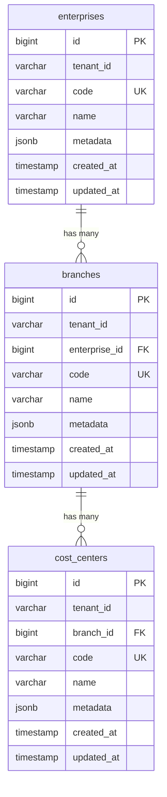
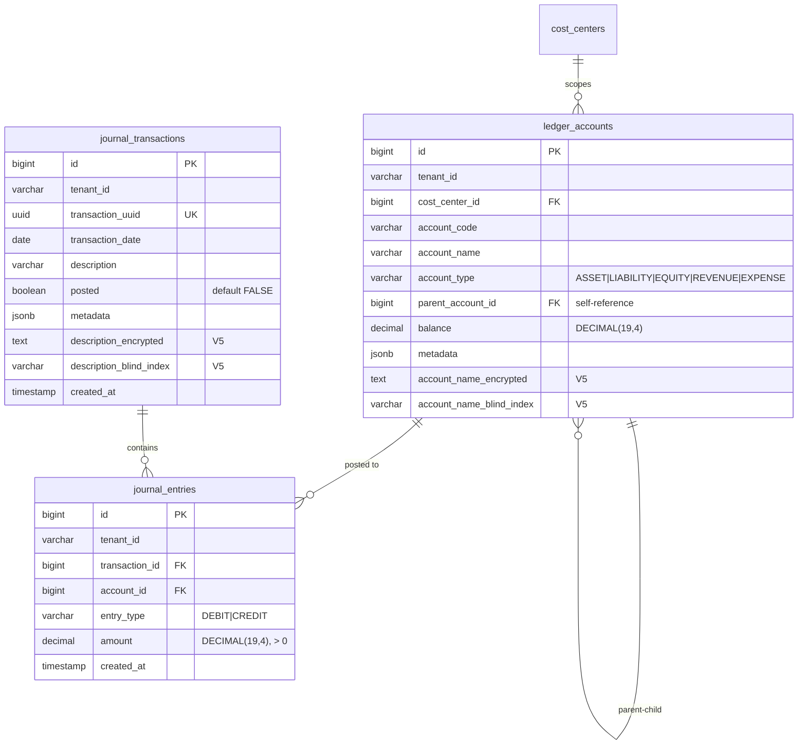
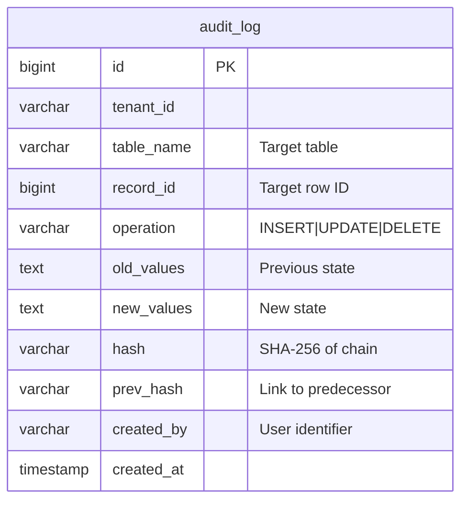
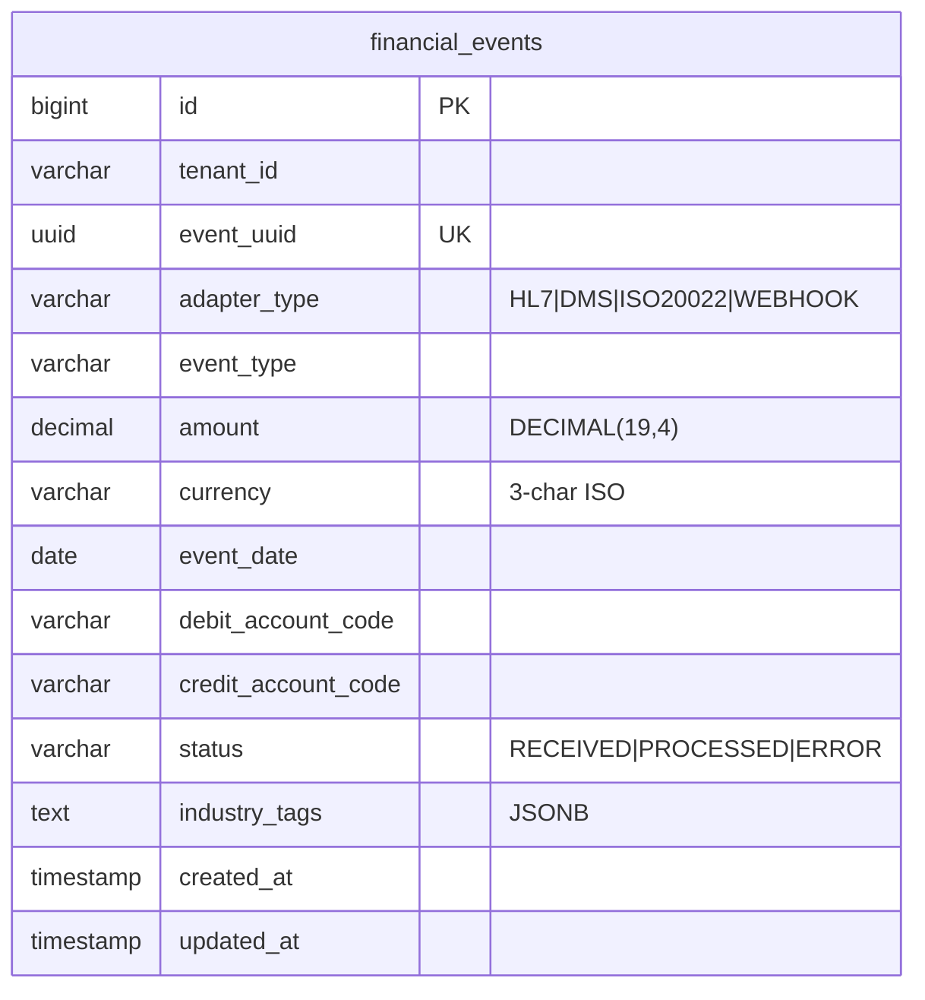
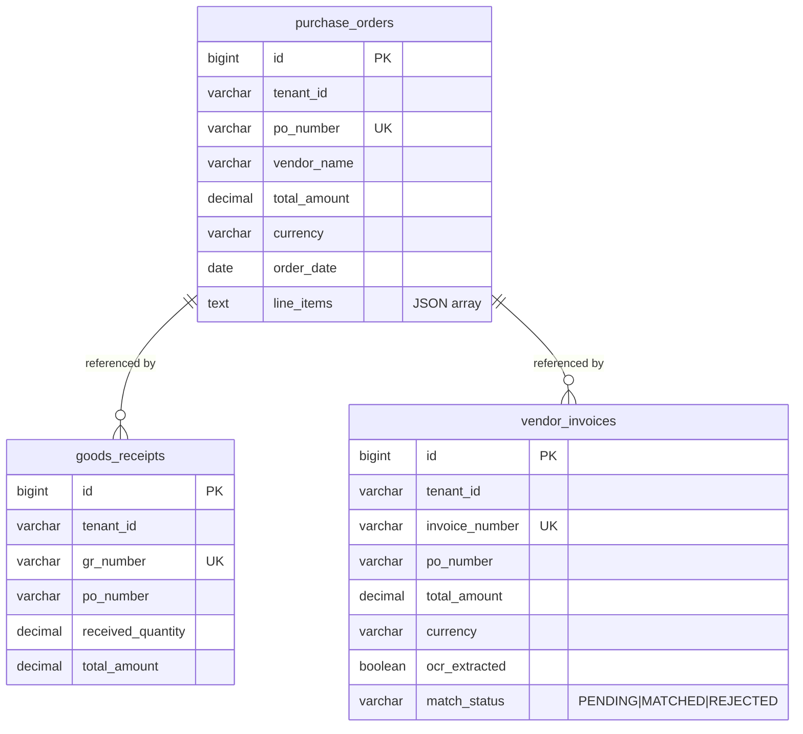
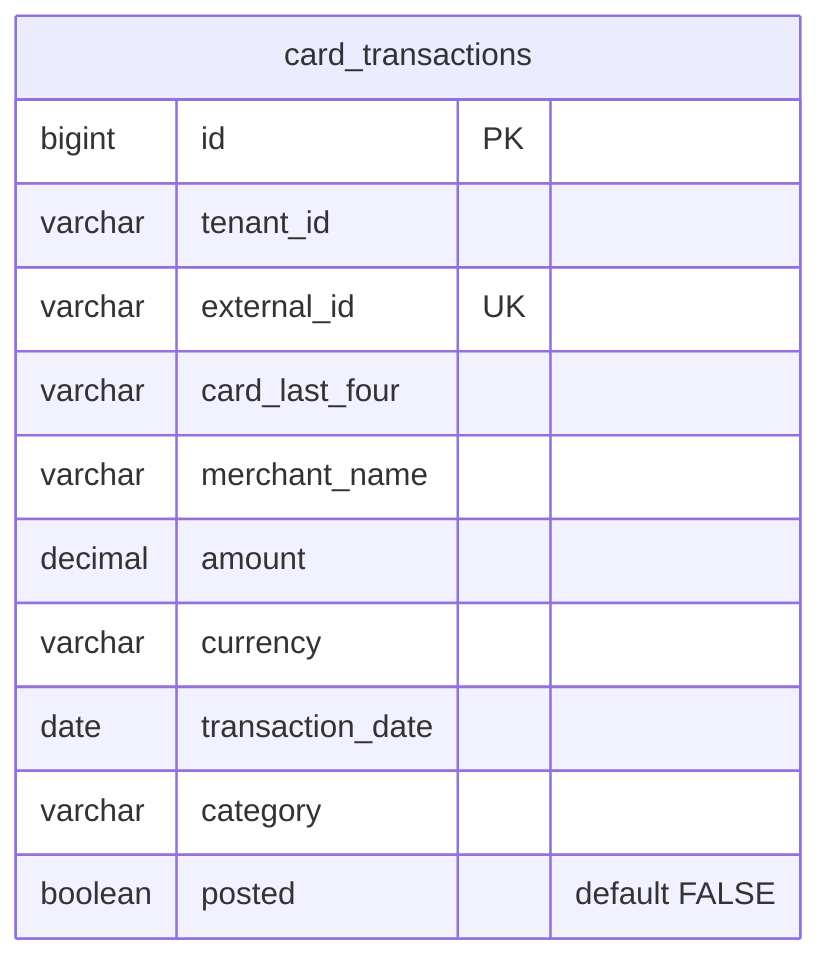
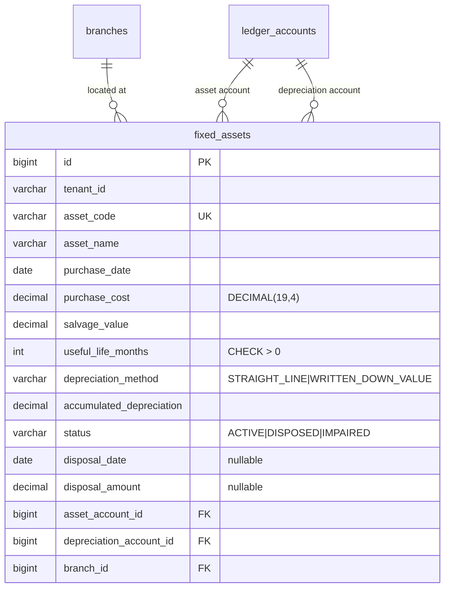
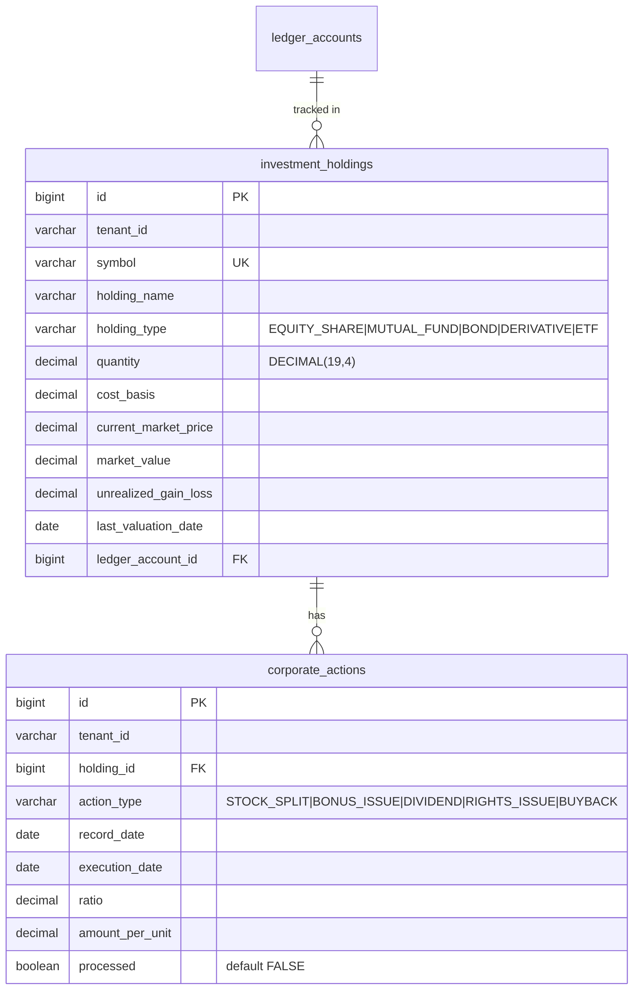
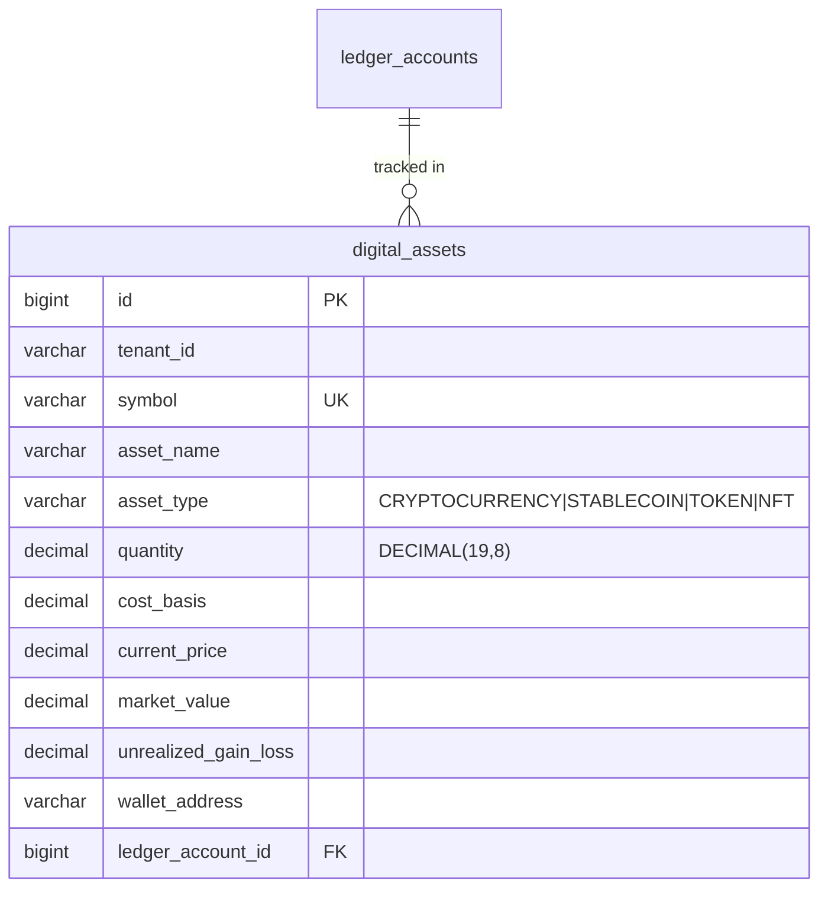
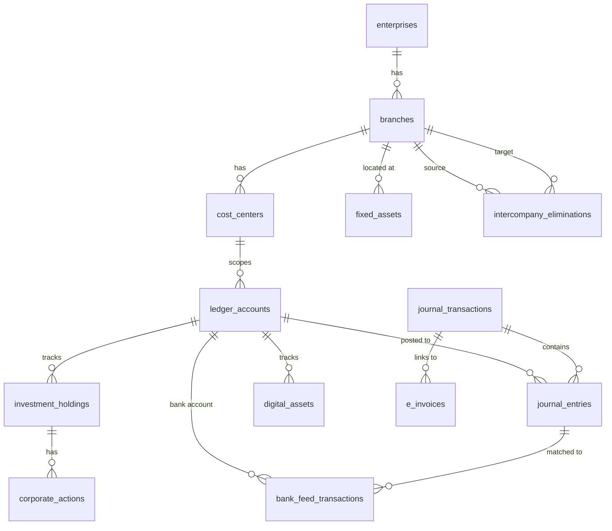

# OneBook — Universal Secured Ledger SQL Schema

> Complete documentation of the PostgreSQL schema powering the Nexus Universal Accounting OS.

---

## Table of Contents

1. [Schema Overview](#schema-overview)
2. [Migration History](#migration-history)
3. [Row-Level Security (RLS)](#row-level-security-rls)
4. [Organizational Hierarchy](#organizational-hierarchy)
5. [Double-Entry Ledger & Journal](#double-entry-ledger--journal)
6. [Seed Data](#seed-data)
7. [Zero-Knowledge Security](#zero-knowledge-security-blind-dba)
8. [Ingestion Layer](#ingestion-layer)
9. [Reporting, Compliance & Fixed Assets](#reporting-compliance--fixed-assets)
10. [AI & Intelligence Features](#ai--intelligence-features)
11. [Entity Relationship Diagram](#entity-relationship-diagram)

---

## Schema Overview

The OneBook schema is designed around three principles:

1. **Multi-Tenant Isolation** — Row-Level Security (RLS) on every table ensures tenants cannot access each other's data, even with direct SQL access.
2. **Zero-Knowledge Encryption** — Sensitive fields are encrypted with AES-256-GCM in the JVM before reaching the database. HMAC-based blind indexes enable search without decryption.
3. **Sector-Agnostic Metadata** — JSONB columns store industry-specific tags (Patient ID, VIN, SKU) without schema changes.

### Database Configuration

| Setting | Value |
|---------|-------|
| Engine | PostgreSQL 17+ |
| Migration Tool | Flyway |
| DDL Mode | `validate` (never auto-create) |
| Precision | DECIMAL(19,4) for financial amounts |
| Crypto Precision | DECIMAL(19,8) for digital asset quantities |
| Timestamps | `TIMESTAMP DEFAULT NOW()` |

---

## Migration History

All schema changes are managed via Flyway migrations in `backend/src/main/resources/db/migration/`.

| Version | File | Milestone | Purpose |
|---------|------|-----------|---------|
| V1 | `V1__rls_infrastructure.sql` | M1 | RLS functions, roles, and policies |
| V2 | `V2__organizational_hierarchy.sql` | M2 | Enterprise → Branch → Cost Center |
| V3 | `V3__ledger_and_journal.sql` | M2 | Chart of Accounts, Journal, balanced posting trigger |
| V4 | `V4__seed_data.sql` | M2 | Default enterprise, branch, cost center, and 13 accounts |
| V5 | `V5__blind_dba_infrastructure.sql` | M3 | Encrypted fields, blind indexes, hash-chained audit log |
| V6 | `V6__ingestion_layer.sql` | M6 | Financial events, 3-way matching, card transactions |
| V7 | `V7__reporting_compliance_far.sql` | M7 | Tenant locale, feature toggles, FAR, e-invoicing, bank reconciliation, intercompany |
| V8 | `V8__ai_intelligence_features.sql` | M8 | Investment holdings, corporate actions, digital assets |

---

## Row-Level Security (RLS)

### Infrastructure (V1)

Every tenant-scoped table uses PostgreSQL RLS with the following pattern:

```sql
-- Session variable set per request by the application
SET app.current_tenant = '<tenant_id>';

-- Function reads the session variable
CREATE FUNCTION current_tenant_id() RETURNS TEXT AS $$
  SELECT current_setting('app.current_tenant', TRUE);
$$ LANGUAGE sql STABLE;
```

### RLS Policy Pattern

Applied to every tenant-scoped table:

```sql
ALTER TABLE <table> ENABLE ROW LEVEL SECURITY;

CREATE POLICY <table>_tenant_isolation ON <table>
  USING (tenant_id = current_tenant_id());
```

### Application Role

```sql
CREATE ROLE onebook_app WITH LOGIN PASSWORD '...';
-- Grants SELECT, INSERT, UPDATE, DELETE on all tenant-scoped tables
```

### Tables with RLS Enabled

All tables in the schema have RLS enabled: `enterprises`, `branches`, `cost_centers`, `ledger_accounts`, `journal_transactions`, `journal_entries`, `audit_log`, `financial_events`, `purchase_orders`, `goods_receipts`, `vendor_invoices`, `card_transactions`, `tenant_locale_configs`, `feature_entitlements`, `fixed_assets`, `e_invoices`, `bank_feed_transactions`, `intercompany_eliminations`, `investment_holdings`, `corporate_actions`, `digital_assets`.

---

## Organizational Hierarchy

### Enterprise → Branch → Cost Center (V2)



**Constraints:**
- `enterprises`: UNIQUE `(tenant_id, code)`
- `branches`: UNIQUE `(enterprise_id, code)`, FK to `enterprises`
- `cost_centers`: UNIQUE `(branch_id, code)`, FK to `branches`

---

## Double-Entry Ledger & Journal

### Core Tables (V3)



### Account Types

| Type | Code Range | Example Accounts |
|------|-----------|-----------------|
| ASSET | 1000–1999 | Cash (1000), Accounts Receivable (1100), Inventory (1200) |
| LIABILITY | 2000–2999 | Accounts Payable (2000), Loans Payable (2100) |
| EQUITY | 3000–3999 | Owner Equity (3000), Retained Earnings (3100) |
| REVENUE | 4000–4999 | Sales Revenue (4000), Service Revenue (4100) |
| EXPENSE | 5000–5999 | COGS (5000), Salaries (5100), Rent (5200), Utilities (5300) |

### Balanced Transaction Trigger

```sql
CREATE FUNCTION check_balanced_transaction()
RETURNS TRIGGER AS $$
DECLARE
    total_debits  DECIMAL(19,4);
    total_credits DECIMAL(19,4);
    debit_count   INTEGER;
    credit_count  INTEGER;
BEGIN
    -- Sum debits and credits for the transaction
    SELECT
        COALESCE(SUM(CASE WHEN entry_type = 'DEBIT' THEN amount END), 0),
        COALESCE(SUM(CASE WHEN entry_type = 'CREDIT' THEN amount END), 0),
        COUNT(CASE WHEN entry_type = 'DEBIT' THEN 1 END),
        COUNT(CASE WHEN entry_type = 'CREDIT' THEN 1 END)
    INTO total_debits, total_credits, debit_count, credit_count
    FROM journal_entries
    WHERE transaction_id = NEW.transaction_id;

    -- Enforce at least one debit and one credit
    IF debit_count = 0 OR credit_count = 0 THEN
        RAISE EXCEPTION 'Transaction must have at least one debit and one credit entry';
    END IF;

    -- Enforce balanced posting
    IF total_debits != total_credits THEN
        RAISE EXCEPTION 'Transaction is not balanced: debits=% credits=%',
            total_debits, total_credits;
    END IF;

    RETURN NEW;
END;
$$ LANGUAGE plpgsql;
```

### Key Constraints

| Table | Constraint | Type |
|-------|-----------|------|
| `ledger_accounts` | `(tenant_id, cost_center_id, account_code)` | UNIQUE |
| `journal_transactions` | `transaction_uuid` | UNIQUE |
| `journal_entries` | `entry_type IN ('DEBIT', 'CREDIT')` | CHECK |
| `journal_entries` | `amount > 0` | CHECK |
| `journal_entries` | `transaction_id → journal_transactions` | FK (CASCADE DELETE) |
| `journal_entries` | `account_id → ledger_accounts` | FK |

### Indexes

| Index | Table | Columns |
|-------|-------|---------|
| `idx_journal_entries_transaction` | `journal_entries` | `transaction_id` |
| `idx_journal_entries_account` | `journal_entries` | `account_id` |

---

## Seed Data

### Default Organizational Structure (V4)

| Entity | Code | Name | Tenant |
|--------|------|------|--------|
| Enterprise | `ENT-001` | Default Enterprise | `default-tenant` |
| Branch | `BR-001` | Head Office | `default-tenant` |
| Cost Center | `CC-001` | General | `default-tenant` |

### Default Chart of Accounts (V4)

| Code | Name | Type |
|------|------|------|
| 1000 | Cash | ASSET |
| 1100 | Accounts Receivable | ASSET |
| 1200 | Inventory | ASSET |
| 2000 | Accounts Payable | LIABILITY |
| 2100 | Loans Payable | LIABILITY |
| 3000 | Owner Equity | EQUITY |
| 3100 | Retained Earnings | EQUITY |
| 4000 | Sales Revenue | REVENUE |
| 4100 | Service Revenue | REVENUE |
| 5000 | Cost of Goods Sold | EXPENSE |
| 5100 | Salaries Expense | EXPENSE |
| 5200 | Rent Expense | EXPENSE |
| 5300 | Utilities Expense | EXPENSE |

---

## Zero-Knowledge Security (Blind DBA)

### Encrypted Fields (V5)

The following columns are added to core tables for field-level encryption:

| Table | Encrypted Column | Blind Index Column |
|-------|-----------------|-------------------|
| `ledger_accounts` | `account_name_encrypted` (TEXT) | `account_name_blind_index` (VARCHAR(64)) |
| `journal_transactions` | `description_encrypted` (TEXT) | `description_blind_index` (VARCHAR(64)) |

**How it works:**
1. Application encrypts the value with AES-256-GCM → stores in `*_encrypted` column
2. Application computes HMAC-SHA256 of plaintext → stores in `*_blind_index` column
3. To search, application computes HMAC of search term → queries `WHERE blind_index = ?`
4. DBA sees only ciphertext and hashes — never plaintext

### Blind Index Performance

| Index | Table | Columns |
|-------|-------|---------|
| `idx_ledger_account_blind_index` | `ledger_accounts` | `(tenant_id, account_name_blind_index)` |
| `idx_journal_txn_desc_blind_index` | `journal_transactions` | `(tenant_id, description_blind_index)` |

### Hash-Chained Audit Log (V5)



**Chain integrity:** Each record's `hash` = `SHA-256(prev_hash || operation || timestamp || data)`. Altering any historical entry breaks the chain, which is detectable by traversing `prev_hash` links.

| Index | Columns | Purpose |
|-------|---------|---------|
| `idx_audit_tenant` | `tenant_id` | Tenant filtering |
| `idx_audit_record` | `(table_name, record_id)` | Lookup by target |
| `idx_audit_hash_chain` | `(tenant_id, prev_hash)` | Chain verification |

---

## Ingestion Layer

### Financial Events (V6)



| Index | Columns | Purpose |
|-------|---------|---------|
| `idx_financial_events_tenant_status` | `(tenant_id, status)` | Filter events by processing status |

### Three-Way Matching (V6)



### Corporate Card Transactions (V6)



| Index | Columns | Purpose |
|-------|---------|---------|
| `idx_card_transactions_tenant_unposted` | `(tenant_id)` WHERE `posted = FALSE` | Quick filter for pending postings |

---

## Reporting, Compliance & Fixed Assets

### Tenant Locale Configuration (V7)

| Column | Type | Description |
|--------|------|-------------|
| `tenant_id` | VARCHAR | UNIQUE — one config per tenant |
| `country_code` | VARCHAR(10) | ISO country code |
| `currency_code` | VARCHAR(10) | ISO currency code |
| `locale` | VARCHAR(20) | Display locale |
| `tax_regime` | VARCHAR(50) | GST, VAT, IFRS, etc. |
| `fiscal_year_start_month` | INT | 1–12 (default: 4 for India) |

### Feature Entitlements (V7)

| Column | Type | Description |
|--------|------|-------------|
| `tenant_id` | VARCHAR | |
| `feature_code` | VARCHAR(100) | e.g., `MTM_VALUATION`, `EWAY_BILL` |
| `enabled` | BOOLEAN | Default: FALSE |

UNIQUE constraint: `(tenant_id, feature_code)` — one toggle per feature per tenant.

### Fixed Asset Register (V7)



### Electronic Invoicing (V7)

| Column | Type | Description |
|--------|------|-------------|
| `invoice_number` | VARCHAR(50) | |
| `invoice_date` | DATE | |
| `buyer_gstin` | VARCHAR(20) | India GST Identification |
| `seller_gstin` | VARCHAR(20) | |
| `total_amount` | DECIMAL(19,4) | |
| `tax_amount` | DECIMAL(19,4) | |
| `irn` | VARCHAR(100) | Invoice Reference Number |
| `status` | VARCHAR(20) | DRAFT, GENERATED, CANCELLED |
| `e_way_bill_number` | VARCHAR(20) | |
| `journal_transaction_id` | BIGINT FK | Links to posted journal |

### Bank Feed Transactions (V7)

| Column | Type | Description |
|--------|------|-------------|
| `external_transaction_id` | VARCHAR(100) | UNIQUE per tenant |
| `bank_account_id` | BIGINT FK | → `ledger_accounts` |
| `amount` | DECIMAL(19,4) | |
| `matched` | BOOLEAN | Default: FALSE |
| `matched_journal_entry_id` | BIGINT FK | → `journal_entries` (nullable) |
| `source` | VARCHAR(20) | MANUAL, OPEN_BANKING, CSV_IMPORT |

### Intercompany Eliminations (V7)

| Column | Type | Description |
|--------|------|-------------|
| `source_branch_id` | BIGINT FK | → `branches` |
| `target_branch_id` | BIGINT FK | → `branches` |
| `elimination_amount` | DECIMAL(19,4) | |
| `eliminated` | BOOLEAN | Default: FALSE |
| `elimination_date` | DATE | |

CHECK: `source_branch_id != target_branch_id`

---

## AI & Intelligence Features

### Investment Holdings (V8)



### Digital Assets (V8)



---

## Entity Relationship Diagram

### Complete Schema Overview



---

## Related Documentation

- [Architecture Diagram](architecture-diagram.md)
- [Key-Binding Registry Design](key-binding-registry.md)
- [API Documentation](api-documentation.md)
- [Developer Onboarding Guide](developer-guide.md)
- [Operational Runbook](operational-runbook.md)
